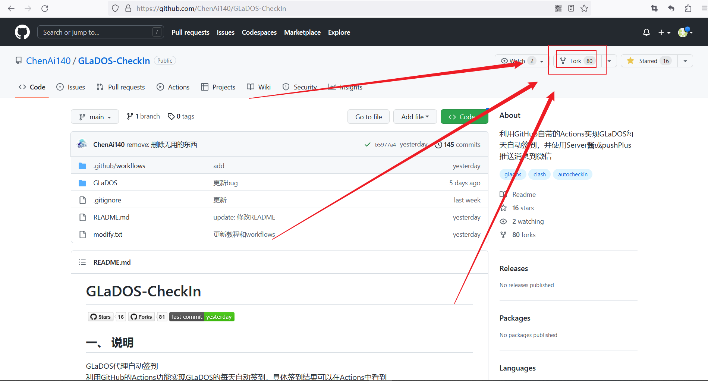
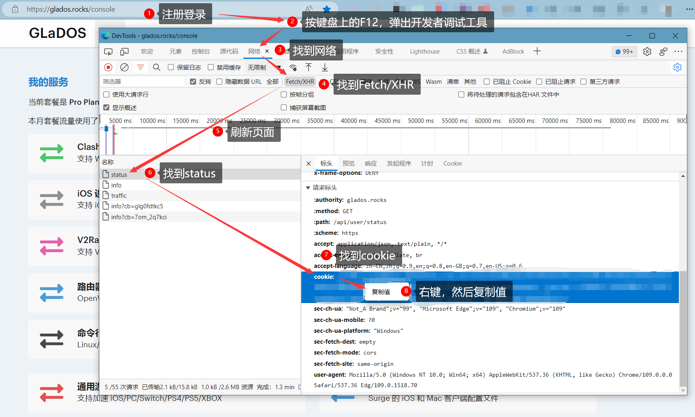
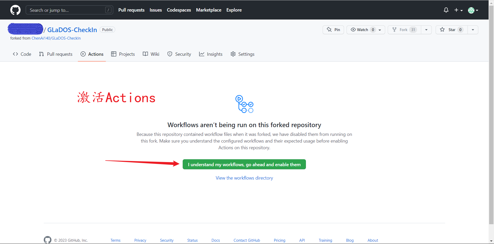
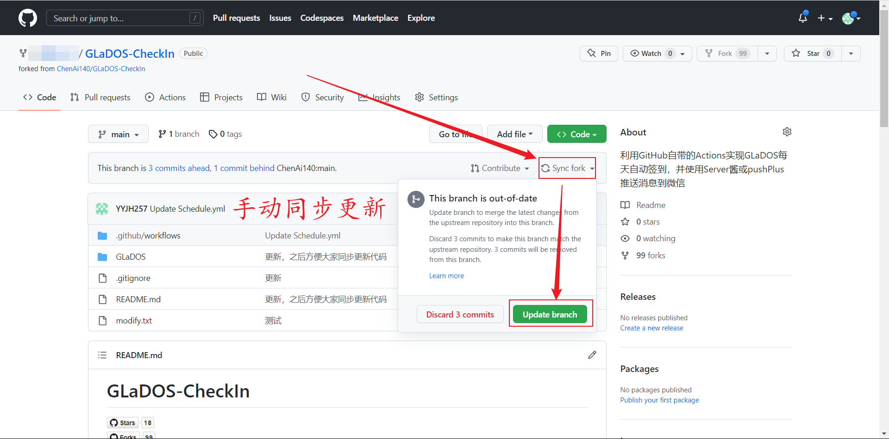
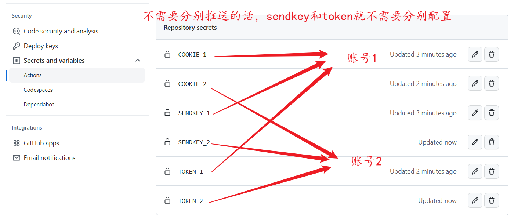
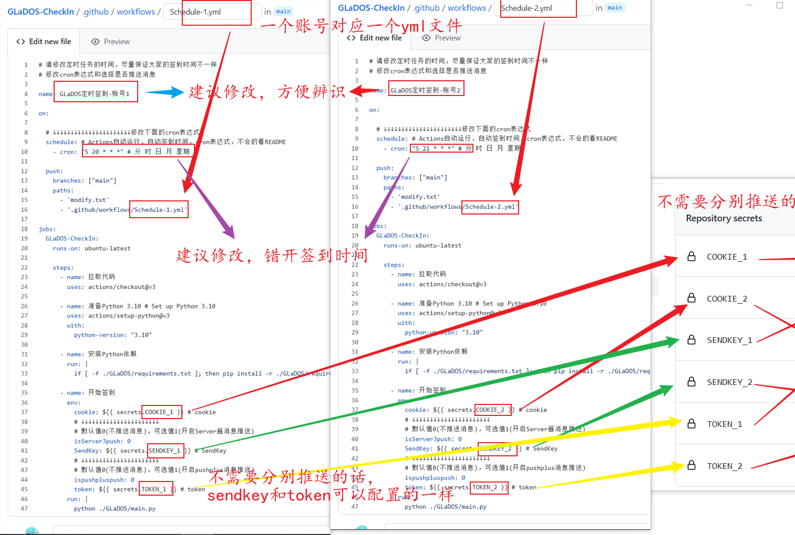

##  自动签到教程

1. Fork此仓库  
    

点击此处展开
<pre>
    点击右上角的 Fork 按钮
         
    点击 Create fork ，然后等待仓库创建成功
        
    </pre> 

2. 注册GLaDOS，并获取cookie  
    

点击此处展开
<pre>
    注册GLaDOS：略    
    获取cookie
        
    </pre> 

3. 填写`secrets`  
   将cookie填入`Settings` -> `Secrets and variables` -> `Actions` -> `Repository secrets`中，命名一定要是`GLADOS_COOKIE`
   
    

点击此处展开
<pre>
    将cookie填入secrets
        
    </pre> 

   
4. 激活Actions  
   

点击此处展开
<pre>
    激活Actions，点击同意
        
    </pre> 

## 配置微信推送(非必须)  

可以不配置，可以只配置其中一个，也可以都配置  

### 1. Server酱  

和配置cookie一样的方式，将Server酱中的SendKey复制到`Repository secrets`命名为 `SENDKEY`  
然后去你创建的那个`.yml`文件里面修改`isServerJpush`的值为`1`  
[Server酱](https://sct.ftqq.com/)  
暂时只支持`方糖服务号`进行推送(因为懒)  
若此通道被弃用，那到时候再说吧  

### 2. pushPlus  

和配置cookie一样的方式，将pushpuls微信公众号中的token复制到`Repository secrets`命名为 `TOKEN`  
然后去你创建的那个`.yml`文件里面修改`ispushpluspush`的值为`1`  
[pushPlus](https://www.pushplus.plus/)  

## 其它

#### 更新仓库
如果需要更新代码，可以重新Fork此仓库  
或者手动同步更新代码  

   

点击此处展开
<pre>
    点击 Sync fork，然后点击 Update branch 即可更新代码，这样会保留自己的修改，无需重新配置
        
    </pre> 

2023-3-7之前的Fork需要点击`Sync fork` -> `Discard * commits`放弃之前的修改，强制更新，然后重新按教程配置Schedule.yml    

#### 多账号配置  

点击此处展开
<pre>
PS: 图片看不清就点开看  
在Repository secrets里面添加多个cookie和推送的key，并分别命名
    
在workflows里面新建yml文件，并修改相应的内容
    
</pre> 

